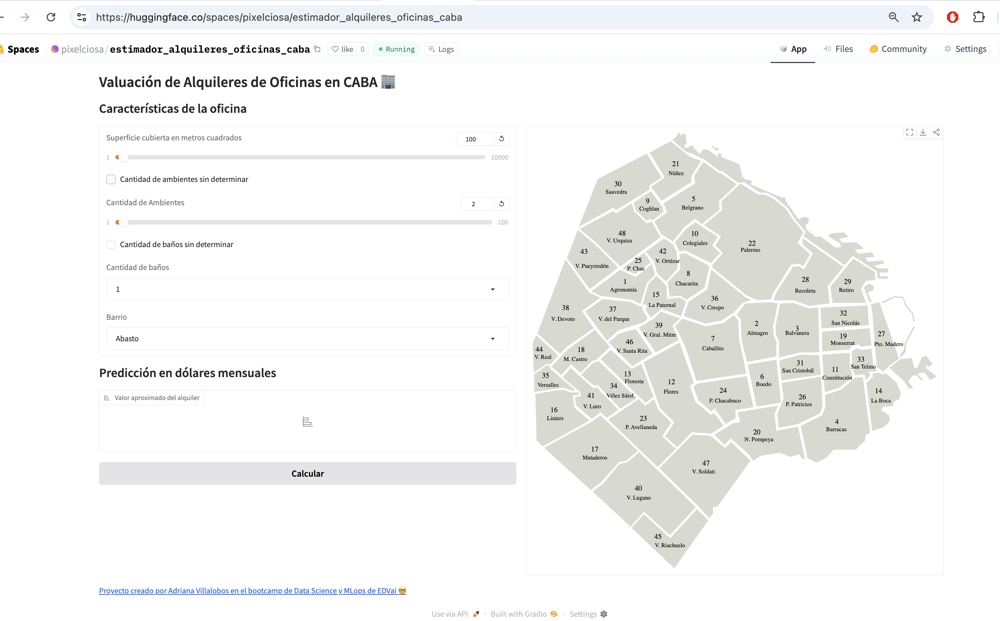

# Proyecto Final de Ciencia de Datos y MLOps
Este proyecto corresponde al entregable final del bootcamp de Ciencia de Datos y MLOps de EDVai.
Su objetivo es realizar un análisis exploratorio de datos (EDA), construir un modelo predictivo y desplegarlo mediante una interfaz interactiva con Gradio.

Incluye buenas prácticas de ingeniería de datos, trazabilidad de experimentos con MLflow y control de versiones de modelos mediante Git LFS.

## Entorno
- Python 3.11.13
- Entorno virtual: `.venv`
- Dependencias completas listadas en `requirements.txt` (para instalación exacta)
- Dependencias principales listadas en  `requirements_main.txt` (para documentación y lectura)

## Cómo recrear el entorno

python3.11 -m venv .venv
source .venv/bin/activate
pip install -r requirements.txt

## Correr la aplicación de forma local
- Ejecutar desde el folder raíz: `python app/app.py`
- Para probar la API localmente ejecutar: src/call-api.py, (necesita descomentar la línea de cliente local y ajustar el puerto donde esté corriendo Gradio)

# Abrir la aplicación de HuggingFace:
- https://huggingface.co/spaces/pixelciosa/estimador_alquileres_oficinas_caba
- Para probar la API localmente ejecutar: src/call-api.py

# Ejemplo para probar la API
```python
client = Client("pixelciosa/estimador_alquileres_oficinas_caba")
result = client.predict(
	param_0=5,
	param_1=4,
	param_2=600,
	param_3="Catalinas",
	api_name="/prediccion"
)
print(result)
```

# Captura del funcionamiento
